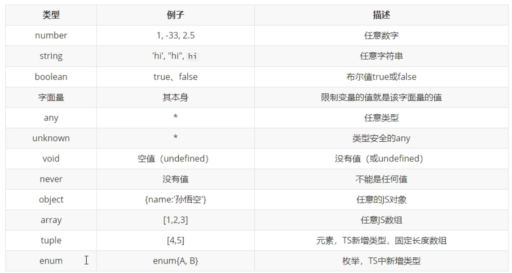

# 类型声明

类型声明是 ts 中非常重要的一个特点，通过类型声明可以指定 ts 中变量（参数、形参）的类型。指定类型后，当为变量赋值时，ts 编译器会自动检查值是否符合类型声明，符合则赋值；否则报错。

语法：

```typescript
let 变量: 类型
let 变量: 类型 = 值
function fc(参数: 类型，参数: 类型): 类型 {   
}
```

# 类型



可以使用 type 声明类型别名

```typescript
type myType = string | number | ({name: string} & {age: number})
```

# 用法

+ 可以使用 | 来连接多个类型（联合类型）或者值。

```typescript
let a: 'first' | 'second'
let b: string | number
a = 'first'
console.log(a)
a = 'second'
console.log(a)
b = 'third'
console.log(b)
b = 123
console.log(b)
```

+ 可以使用 & 来连接多个对象属性

```typescript
let obj: {name: string} & {age: number}
// obj = {name: 'tom'}
obj = {
    name: 'tom',
    age: 18
}
```

+ 如果声明变量如果不指定类型，则 ts 解析器会自动判断变量的类型为 any（隐式 any）。

+ 如果不确定类型，可以使用 any，但是推荐使用 unknown。unknow 实际上就是一个类型安全的 any，unknown 类型的变量，不能直接赋值给其他变量。
+ 如果 unknown 类型的变量想要赋值给其他变量，需要使用类型断言：用来告诉解析器变量的实际类型。

```typescript
let a: unknown = 'hello'
let b: string
// b = a
b = a as string
b = <string> a
```

+ void 只能赋值 undefined 和 null，而 never 连这两种也不会有。
+ 在对象的属性名后面加上，表示属性是可选的。
+ \[propName: string]: any，在属性中加入该语句，表示可以添加任意的属性。

```typescript
let a: {name: string, [propName: string]: any}
a = {name: 'tom'}
a = {name: 'tom', age: 18, sex: 'male'}

let b: {name: string, age?: number}
b = {name: 'tom'}
b = {name: 'tom', age: 18}
```

+ 表示数组的方式：string[]、Array\<string>
+ 元组的表示就是固定长度的数组：[string, string]
+ 枚举的表示如下

```typescript
enum Gender {
    Male,
    Female
}
let obj: {name: string, gender: Gender}
obj = {
    name: 'tom',
    gender: Gender.Male
}
console.log(obj.gender === Gender.Male)
```